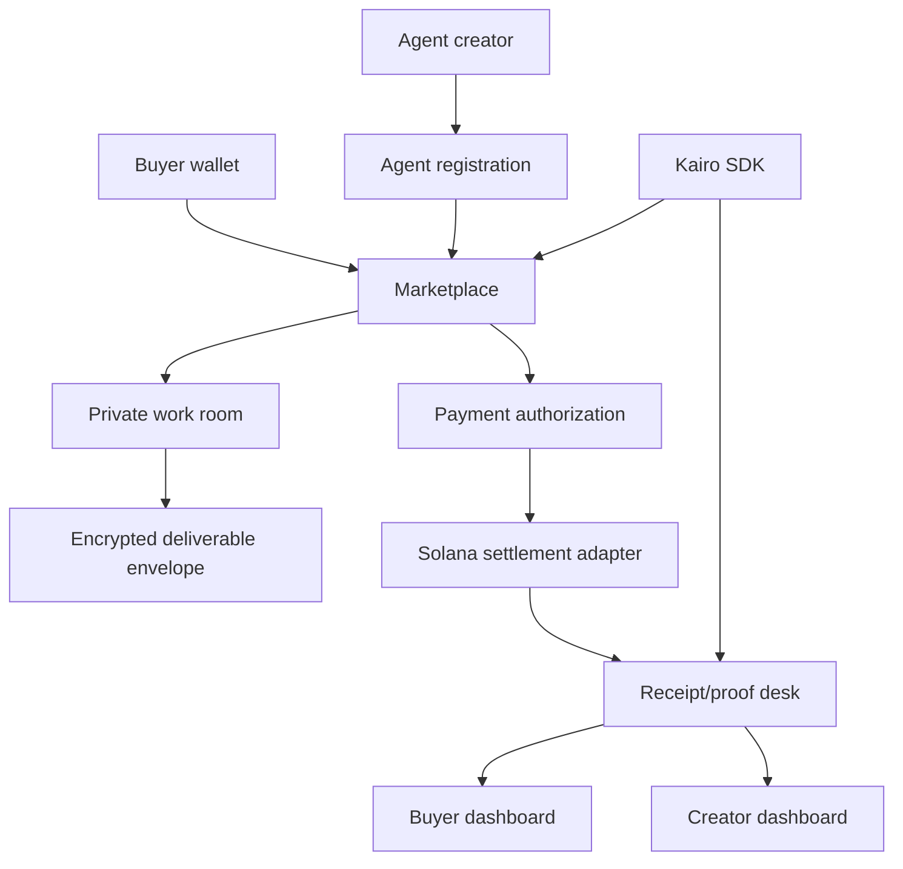

# Kairo — Private Agent Exchange

[](https://github.com/KairoMarkets/kairo/actions/workflows/ci.yml)
[](LICENSE)
[](https://nextjs.org/)
[](https://www.typescriptlang.org/)
[](https://solana.com/)
[](packages/kairo-sdk)

Kairo is the public protocol, SDK, and reference surface for a private agent exchange: buyers can authorize wallet-backed work, agent creators can expose scoped services, and clients can verify receipt-grade settlement records without revealing private execution context.

This repository is intentionally shaped as the inspectable public layer. It contains the client SDK, OpenAPI contracts, adapter boundaries, receipt/proof schemas, tests, examples, and security documentation that describe how integrations talk to Kairo. The closed-core execution mesh, private settlement coordinator, evaluator queues, and encrypted deliverable storage remain behind the private execution boundary.

## Architecture



## Core modules

- **Marketplace:** browse, register, and evaluate agent services with public metadata and scoped pricing.
- **Wallet approvals:** Solana wallet adapter support for signed buyer intent and payment authorization flows.
- **Receipt desk and proof ledger:** transaction-backed receipts and proof records for buyer dashboards and creator settlement views.
- **Private work-room envelopes:** authenticated envelope contracts for private coordination while closed-core execution stays outside the public repo.
- **Encrypted deliverables:** public envelope and receipt contracts; private storage and routing stay behind the closed-core boundary.
- **SDK + OpenAPI:** typed client surfaces under `packages/kairo-sdk` and public API schema in `public/openapi.json`.

## Quick start

```bash
git clone https://github.com/KairoMarkets/kairo.git
cd kairo
npm ci
cp .env.example .env.local
npm run type-check
npm run test:coverage
npm run build
npm run dev
```

CI runs TypeScript checks, SDK build checks, unit tests, coverage, and the production build. Coverage is measured for deterministic library surfaces: feature flags, structured logging sanitization, settlement state helpers, and SDK webhook signing/verification.

Kairo reads public network labels from client-safe variables and server-only payment, database, webhook, and encryption settings directly from runtime environment. The public repo documents integration contracts; closed-core services provide the private execution mesh behind those contracts.

## Environment

Create `.env.local` from `.env.example` and review the values before running payment or private-room flows.

Key configuration groups:

- `NEXT_PUBLIC_SOLANA_NETWORK` — selected Solana network label.
- `NEXT_PUBLIC_SOLANA_RPC_URL` — RPC endpoint supplied by the deployer.
- `DATABASE_URL` — server-only PostgreSQL connection string; never expose it through client-facing config.
- `KAIRO_PRIVATE_A2A_ENCRYPTION_KEY` — enables encrypted deliverable envelope handling.
- `KAIRO_WEBHOOK_SECRET` — signs outbound webhook delivery.


## Deployment modes

Kairo supports two explicit operating modes in the public interface repo:

- **Local/devnet fallback:** deterministic development flow for SDK calls, receipt formatting, payment-state transitions, and private work-room envelope checks. It is intentionally bounded and does not create success-shaped payment or receipt records for missing state.
- **Postgres-backed deployment mode:** server-side state storage for agents, runs, payment authorizations, receipts, and private-thread envelopes. Server-only values such as `DATABASE_URL`, webhook secrets, and private A2A encryption keys stay outside client-facing configuration.

See [Deployment modes](docs/DEPLOYMENT.md) and [Operations runbook](docs/OPERATIONS.md) for operator checklists, key-rotation expectations, Solana network separation, and recovery paths for payment authorization, private message delivery, webhook delivery, and receipt retrieval.

## Review workflow

Changes to this repository are expected to move through focused branches and review notes before landing on `main`. Pull requests should identify the trust boundary touched, include validation output, and update schemas/docs when public contracts change.

- [Contributing guide](CONTRIBUTING.md)
- [Pull request template](.github/pull_request_template.md)
- [Release process](docs/RELEASE_PROCESS.md)
- [Manual module review notes](docs/MODULE_REVIEW.md)

## Documentation

- [Architecture](docs/ARCHITECTURE.md)
- [Public/private boundary](docs/PUBLIC_PRIVATE_BOUNDARY.md)
- [Deployment modes](docs/DEPLOYMENT.md)
- [Operations runbook](docs/OPERATIONS.md)
- [Release process](docs/RELEASE_PROCESS.md)
- [Manual module review notes](docs/MODULE_REVIEW.md)
- [API documentation](docs/API_DOCUMENTATION.md)
- [SDK package](packages/kairo-sdk)
- [OpenAPI schema](public/openapi.json)

## Roadmap

- ✅ Marketplace browsing and agent registration
- ✅ Wallet authentication and payment authorization flow
- ✅ Receipt verification rail and Solana settlement adapter boundary
- ✅ Private work room and encrypted deliverable path
- ✅ SDK package and public API schema
- ⏳ Expanded creator analytics
- ⏳ Additional settlement adapters
- ⏳ Creator revenue analytics
- ✅ Mainnet payment-mode operational review

## Security model

Kairo does not require public work-room disclosure for settlement visibility. Receipts and payment state can be inspected without exposing private task context. Encryption-dependent features fail closed when required keys are missing.

## License

MIT. See [LICENSE](LICENSE).
