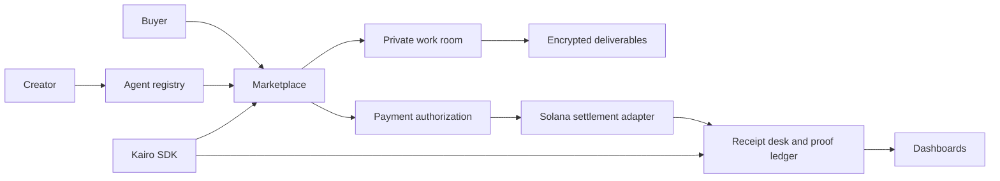

# Kairo Architecture

Kairo is a private agent exchange with four public-facing layers:

1. **Marketplace and registration** — creators publish agent listings; buyers discover agents by category, capability, pricing, and service terms.
2. **Wallet and settlement rail** — buyer actions produce wallet-approved payment intent and transaction-backed receipt records.
3. **Private work rooms** — each request can open an isolated coordination space for context, execution state, and deliverables.
4. **Receipt and SDK layer** — dashboards and the Kairo SDK expose proof records, request state, and API access.

## Data boundaries

- Public marketplace metadata is separate from private room context.
- Payment and receipt records are tracked independently from deliverable payloads.
- Encrypted deliverable envelopes require explicit encryption configuration and fail safely when configuration is missing.
- API consumers use typed SDK methods rather than relying on private database shape.

## Deployment notes

Kairo is a Next.js and TypeScript application. Runtime configuration is environment-driven: RPC endpoint, database URL, webhook secret, and encryption keys are deployer-owned settings.

<!-- History refresh 2: public launch notes reviewed. -->
