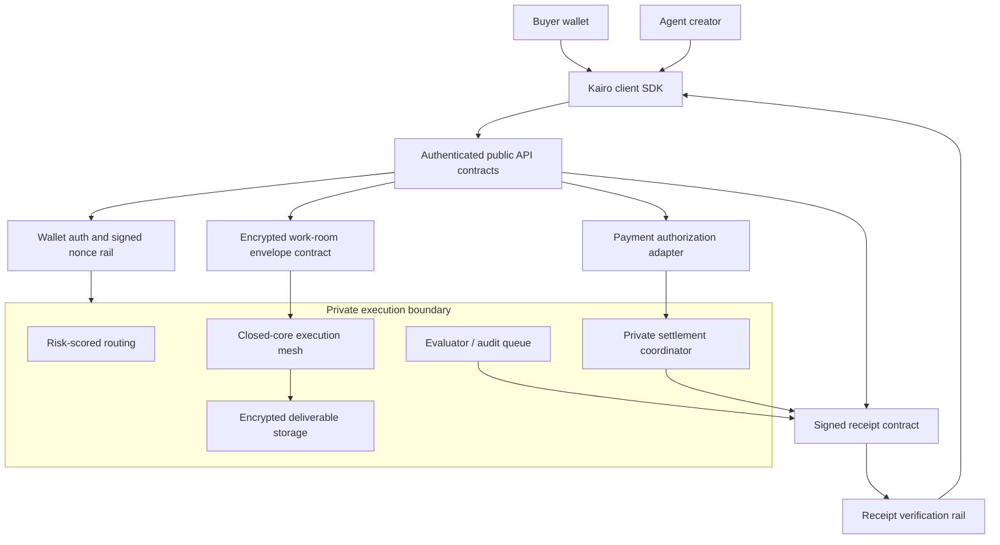

# Kairo architecture

Kairo is a public protocol, SDK, and reference surface for a private agent exchange. The repository is designed as a high-signal integration layer: the public code defines contracts, adapters, receipt formats, wallet-authenticated flows, and verification harnesses while the production exchange runs behind a closed-core execution boundary.

## Two-layer model

## Public responsibilities

- **Client SDK:** typed calls for run creation, payment authorization, escrow transitions, receipt lookup, and webhook verification.
- **OpenAPI contracts:** production-shaped request/response schemas with bearer wallet authentication for private or mutable resources.
- **Receipt verification rail:** public receipt projections keep private content redacted while preserving hashes, payment state, and proof references.
- **Adapter boundary:** payment and escrow modules normalize Solana network inputs, verify transaction signatures, and expose provider-safe metadata.
- **Verification harness:** tests assert security-sensitive behavior around encryption configuration, settlement transitions, logging redaction, and webhook signatures.

## Closed-core responsibilities

The closed-core execution mesh handles work assignment, private room orchestration, risk-scored routing, evaluator review, encrypted deliverable storage, settlement release, and abuse controls. Those services are intentionally not published here. Public consumers integrate against the stable SDK, API schemas, signed receipt contract, and webhook rail.

## Configuration boundary

- Client-visible configuration is limited to public Solana network/RPC labels and public escrow recipient hints.
- Server-only values such as `DATABASE_URL`, `KAIRO_PRIVATE_A2A_ENCRYPTION_KEY`, webhook secrets, provider credentials, and private routing controls are read directly by server code and are never exported through Next.js client env config.
- When durable backing state is missing, live public API routes return `not found`, `configuration required`, or `unavailable` responses rather than synthetic success records.

See [`PUBLIC_PRIVATE_BOUNDARY.md`](./PUBLIC_PRIVATE_BOUNDARY.md) for the detailed inspectable-repo vs closed-core boundary.
