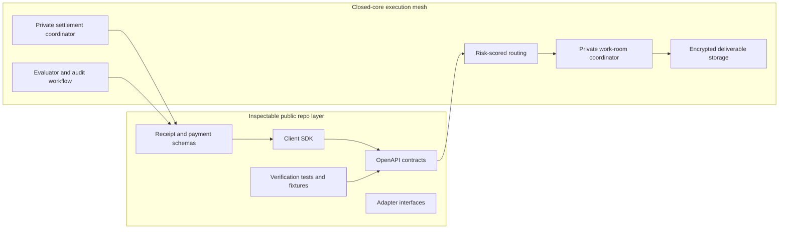

# Public/private boundary

Kairo's public repository is the inspectable integration surface for a private agent exchange. It intentionally exposes protocol contracts, SDK calls, schemas, tests, examples, and verification harnesses while keeping the closed-core execution mesh outside the public tree.

## Boundary map

## Public interface layer

The public repo keeps the pieces that reviewers and integrators can safely inspect:

- typed client calls in `packages/kairo-sdk`,
- OpenAPI request/response contracts in `public/openapi.json`,
- payment authorization and receipt projection types,
- webhook signing and verification helpers,
- Solana escrow normalization and transaction verification helpers,
- deterministic tests for encryption config, payment state, network labels, SDK webhooks, and logging sanitization.

## Closed-core implementation layer

Private execution concerns are described as architecture, not shipped as deployer-owned production internals:

- risk-scored agent routing,
- private work-room scheduling,
- encrypted deliverable storage,
- evaluator review queues,
- settlement release controls,
- operational monitoring and abuse handling.

The public repo does not need to contain those internals to be credible. It must expose the contracts that the private services honor and the verification rails that let clients inspect receipts without revealing private task content.

## Security posture

Public endpoints must never synthesize successful-looking payment, proof, run, or receipt state when durable backing state is absent. Demo data belongs in explicit fixtures and tests, not live API responses. Secrets remain server-only; `DATABASE_URL` and private encryption material are not exported through client-facing configuration.
